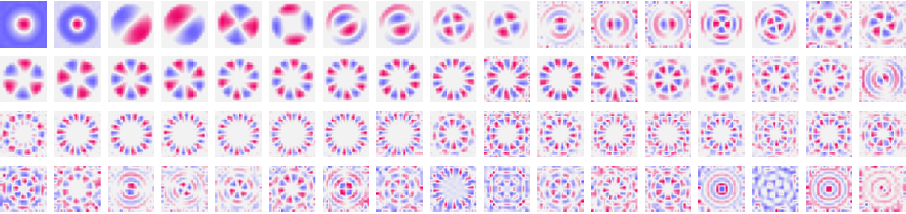

# Harmonics of Learning
<p align="center">

</p>

## Description
Implementation of a complex-valued Power-Spectral Network trained via contrastive learning on an invariance objective for a finite group.
As shown in the companion paper, at convergence the network learns all the irreducible unitary representations of the group. In particular, the multiplication table can be extracted from its weights.


We provide implementations of the model and its training in both `PyTorch` and `JAX`.


## Setup
```
python 3.8+
pip install -r requirements.txt
```


## Groups
The file `groups.py` provides implementations of various finite groups, including cyclic, dihedral and symmetric.

## Training
In order to train the models in `PyTorch` and in `JAX`, run the files `train_torch.py` and `train_JAX.py` respectively. The training parameters are set at the beginning of these files.
